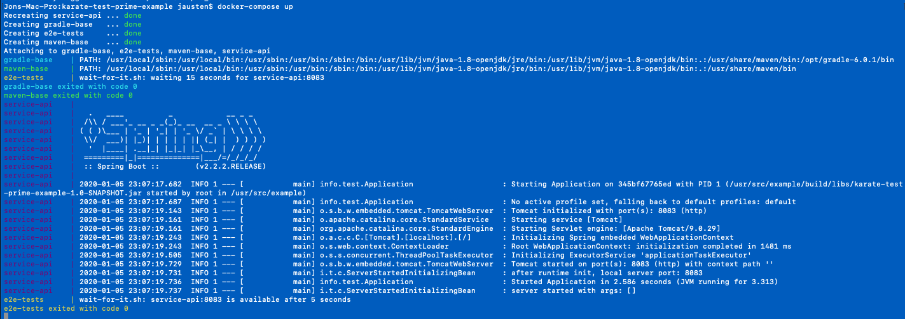

# karate-prime-example

A project to try to show a nice way of configuring Karate to test a Spring Boot project.

## Execution

#### Execute Directly

Run Spring Boot app by running the `Application` jar directly.  It has a main() method.

Then, in a separate terminal, run the Karate tests against the application with:

    gradle test

The test report can then be found at `build/cucumber-html-reports/overview-features.html`

#### Execute With Docker Compose

Build the docker containers by running this command from project root folder:

    docker-compose build
    
Then, start service and execute tests with this command:

    docker-compose up

This is a output example:

## Generate Artifacts

Assemble runnable jar with:

    gradle build

The .jar artifact can be found at `build/libs` .
    
## Other Docker Commands

List all images:

    docker images
    
Clean up all unused images:

    docker system prune -a
    
Run an instance of Portainer:

    docker run -d -p 9000:9000 -v /var/run/docker.sock:/var/run/docker.sock portainer/portainer --no-auth
    
    
    
